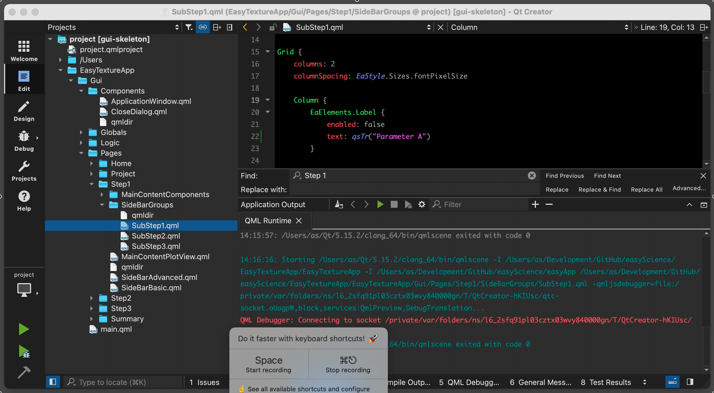

# TODO

Let's divide the development process into several steps.

## Defining the workflow

- [ ] Create a `Jupyter Notebook` with a simple example of complete data processing. Ideally, this `Notebook` should:
	- [ ] Have only those dependencies available through [PyPI](https://pypi.org/).
	- [ ] Use [Bokeh](https://bokeh.org/) as a plotting library.
	- [ ] Be divided into several chapters, each corresponding to one step in the data processing workflow. An example from the diffraction data analysis workflow:
		- Project definition.
		- Model description (Main step 1).
		- Experiment description (Main step 2).
		- Analysis step (Main step 3).
		- Summary report.
	- [ ] Each chapter should contain one or more basic visualization widgets, e.g., raw 3d plots from the detector, reduced 1d diffraction pattern, etc.
	- [ ] Each chapter should have controls for the main visualization widgets, e.g. text edit boxes and comboboxes with configuration parameters, buttons to start the reduction process, read-only fields with some important metadata, etc. These controls should be divided into named groups indicating whether they are intended for the general (basic controls) or advanced (advanced controls) user.

## Prototyping the graphical user interface

- [ ] Create a skeleton of the GUI application. No Python backend is required at this stage. All development is done in pure `Qt QML` based on the generic technic-independent [EasyApp](https://github.com/EasyScience/EasyApp) from the [EasyScience](https://github.com/EasyScience) framework.
- [ ] Add all technique-specific GUI elements based on the `Jupyter Notebook` from the previous chapter.

### EasyScience project structure

For EasyApp developers, the following shows where EasyApp can be located relative to EasyExampleApp to simplify the development process.

```
EasyScience 	       		    - Parent directory.
├── EasyApp     		        - Directory with EasyApp project.
├── EasyExampleApp     	    - Directory with EasyExampleApp project.
└── ...
```

### EasyExampleApp project structure

```
EasyExampleApp        		  - Project directory.
├── EasyExampleApp     		  - Directory with GUI and Logic components.
│   ├── Gui                 - Directory with Qt QML components of the graphical interface / front-end.
│   │   ├── main.qml		    - Main QML file.
│   │   └── ...
│   ├── Logic		            - Directory with Python components of the back-end.
│   ├── main.py   		      - Main Python file.
│   └── ...
├── qml_project.qmlproject	- QML project description file for QtCreator (to be used by qml/qmlscene).
├── py_project.qmlproject	  - Python project description file for QtCreator (to be used by python).
├── pyproject.toml          - Python build system requirements.
└── ...
```

### How to run and edit the GUI prototype.

* Create and go to `EasyScience` directory, e.g.:
  ```
  mkdir EasyScience && cd EasyScience
  ```
* Download the `new_easy_app2` branch of [EasyApp](https://github.com/EasyScience/EasyApp) from GitHub, e.g.:
	```
	git clone --branch new_easy_app2 https://github.com/EasyScience/EasyApp.git
	```
* Download the `new_easy_app2` branch of [EasyExampleApp](https://github.com/EasyScience/EasyExampleApp) from GitHub, e.g.:
	```
	git clone --branch new_easy_app2 https://github.com/EasyScience/EasyExampleApp.git
	```
* Install `Qt 6.4.*`, including the following modules that may be unselected by default:
	* `Qt 5 Compatibility Module`
	* `Qt WebEngine`
* From `Qt Creator` open the project file `qml_project.qmlproject` in the `EasyExampleApp` directory.
* Click the green `Run` button at the bottom of the left sidebar of the `Qt Creator`.

### How to edit GUI elements in live mode.

* Open `qml_project.qmlproject` via `Qt Creator` and select the desired `.qml` file.
* Click the `Design` button at the top of the left sidebar of `Qt Creator`. _Note: If this button is disabled, find and click `About plugins...` in the `Qt Creator` menu, scroll down to the `Qt Quick` section and enable `QmlDesigner`._
* In the `Design` window, click the small `Show Live Preview` button in the top panel of the application. _Note: Showing the entire `main.qml` application window in live mode works best when the open `main.qml` is moved to another monitor and does not overlap with `Qt Creator`.



## Binding to the Python backend

To be added later.
